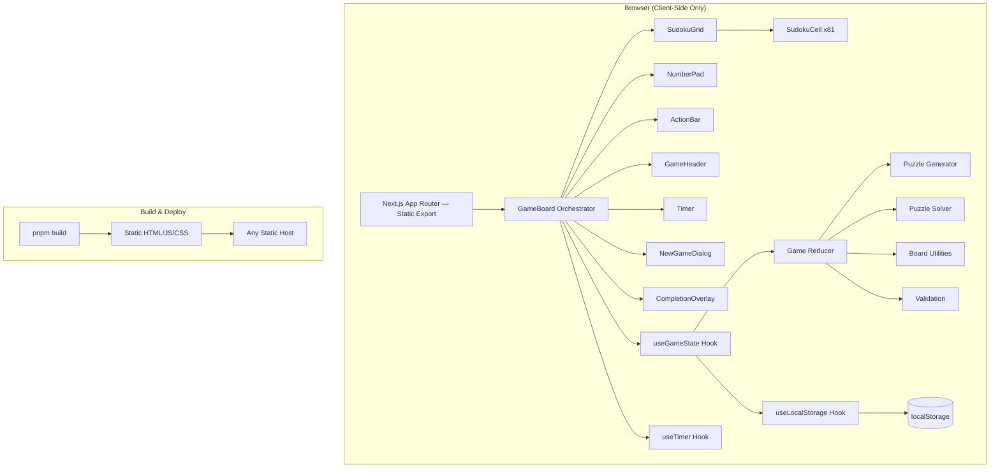

# Sudoku Game — Architecture Document

## 1. High-Level Architecture

The Sudoku game is a fully client-side, single-page application built with Next.js (static export). There is no backend, database, or authentication. All game logic runs in the browser, and game state persists via `localStorage`.



### Deployment Model

- `next build` produces a fully static export (`output: 'export'` in `next.config.ts`)
- No server-side rendering, no API routes, no middleware
- Deployable to any static hosting (GitHub Pages, Vercel static, Netlify, S3, etc.)

## 2. Tech Stack

| Technology | Version | Purpose |
|---|---|---|
| Next.js | 15+ | App Router, static export, build tooling |
| TypeScript | 5+ | Type safety across the codebase |
| React | 19+ | UI rendering (bundled with Next.js 15) |
| Tailwind CSS | 4+ | Utility-first styling |
| Vitest | latest | Unit and component testing |
| @testing-library/react | latest | Component test utilities |
| pnpm | latest | Package manager |

No additional runtime dependencies. No Firebase, Stripe, Resend, OpenAI, or Capacitor.

## 3. Data Models

All types are defined in `src/types/index.ts`.

```typescript
// --- Primitives ---

/** A cell's numeric value: 1-9 or null (empty) */
export type CellValue = 1 | 2 | 3 | 4 | 5 | 6 | 7 | 8 | 9 | null;

/** Row/column position on the board (0-indexed) */
export interface Position {
  row: number; // 0-8
  col: number; // 0-8
}

/** Difficulty levels */
export type Difficulty = 'easy' | 'medium' | 'hard';

// --- Cell ---

export interface Cell {
  value: CellValue;
  isGiven: boolean;       // true if part of the initial puzzle (immutable)
  notes: Set<number>;     // pencil marks (1-9)
  isError: boolean;       // true if value conflicts with row/col/box
}

// --- Board ---

/** 9x9 grid of Cells */
export type Board = Cell[][];

// --- Undo ---

export interface UndoAction {
  position: Position;
  previousCell: Cell;
}

// --- Game State ---

export interface GameState {
  board: Board;
  solution: CellValue[][]; // The complete solved board (9x9 of non-null CellValue)
  difficulty: Difficulty;
  selectedCell: Position | null;
  isPencilMode: boolean;
  timer: number;           // elapsed seconds
  undoStack: UndoAction[];
  isComplete: boolean;
}

// --- Serialization (localStorage) ---

/** Serializable cell (notes as array instead of Set) */
export interface SerializedCell {
  value: CellValue;
  isGiven: boolean;
  notes: number[];
  isError: boolean;
}

export interface SavedGame {
  board: SerializedCell[][];
  solution: CellValue[][];
  difficulty: Difficulty;
  timer: number;
  undoStack: { position: Position; previousCell: SerializedCell }[];
  savedAt: number; // Date.now() timestamp
}
```

## 4. Game Logic Architecture

### 4.1 Puzzle Generation (`src/lib/sudoku-generator.ts`)

Algorithm: **fill-then-remove**

1. **Fill a complete board** using a backtracking solver with randomized candidate ordering
2. **Remove cells** one at a time, checking that the puzzle still has a unique solution after each removal
3. **Difficulty controls** how many cells are removed:
   - Easy: 36-40 clues remaining (41-45 removed)
   - Medium: 30-35 clues remaining (46-51 removed)
   - Hard: 24-29 clues remaining (52-57 removed)

```
generatePuzzle(difficulty: Difficulty): { puzzle: CellValue[][], solution: CellValue[][] }
```

### 4.2 Solver (`src/lib/sudoku-solver.ts`)

Algorithm: **backtracking with constraint propagation**

1. Find the first empty cell
2. For each candidate (1-9), check if placing it is valid (no row/col/box conflict)
3. Place candidate, recurse to next empty cell
4. If no candidate works, backtrack

Two modes:
- `solve(board): CellValue[][] | null` — returns one solution or null
- `countSolutions(board, limit): number` — counts solutions up to `limit` (used by generator to verify uniqueness)

### 4.3 Board Utilities (`src/lib/board-utils.ts`)

- `createEmptyBoard(): Board` — creates a 9x9 board of empty cells
- `getRowPeers(pos): Position[]` — all cells in the same row
- `getColPeers(pos): Position[]` — all cells in the same column
- `getBoxPeers(pos): Position[]` — all cells in the same 3x3 box
- `getAllPeers(pos): Position[]` — union of row, col, and box peers
- `getBoxIndex(pos): number` — which 3x3 box (0-8)
- `hasConflict(board, pos): boolean` — checks if cell conflicts with any peer
- `validateBoard(board): Board` — returns board with `isError` flags updated on all cells
- `isBoardComplete(board, solution): boolean` — checks if board matches solution
- `cloneBoard(board): Board` — deep clone a board

### 4.4 State Management (`src/hooks/useGameState.ts`)

Uses `useReducer` with the following actions:

```typescript
export type GameAction =
  | { type: 'SELECT_CELL'; position: Position }
  | { type: 'SET_VALUE'; value: CellValue }
  | { type: 'TOGGLE_NOTE'; value: number }
  | { type: 'ERASE_CELL' }
  | { type: 'TOGGLE_PENCIL_MODE' }
  | { type: 'UNDO' }
  | { type: 'TICK_TIMER' }
  | { type: 'NEW_GAME'; difficulty: Difficulty; puzzle: CellValue[][]; solution: CellValue[][] }
  | { type: 'RESTORE_GAME'; state: GameState };
```

The reducer:
- Pushes undo entries before mutating cells
- Calls `validateBoard()` after every value change to update error flags
- Checks `isBoardComplete()` after every value change to detect completion
- Never mutates `isGiven` cells

## 5. Project Structure

```
sudoku/
├── docs/
│   ├── architecture.md
│   ├── epics.md
│   └── stories/
│       └── {epic}.{story}.story.md
├── public/
│   └── favicon.ico
├── src/
│   ├── app/
│   │   ├── layout.tsx         # Root layout with fonts + metadata
│   │   ├── page.tsx           # Game page (single page app)
│   │   └── globals.css        # Tailwind imports
│   ├── components/
│   │   ├── ui/                # Reusable primitives (Button, Dialog, Badge)
│   │   │   ├── button.tsx
│   │   │   └── dialog.tsx
│   │   └── game/              # Game-specific components
│   │       ├── SudokuGrid.tsx
│   │       ├── SudokuCell.tsx
│   │       ├── NumberPad.tsx
│   │       ├── ActionBar.tsx
│   │       ├── GameHeader.tsx
│   │       ├── Timer.tsx
│   │       ├── NewGameDialog.tsx
│   │       ├── CompletionOverlay.tsx
│   │       └── GameBoard.tsx  # Main orchestrator component
│   ├── hooks/
│   │   ├── useGameState.ts    # Core game state reducer
│   │   ├── useTimer.ts        # Timer hook
│   │   └── useLocalStorage.ts # Auto-save hook
│   ├── lib/
│   │   ├── sudoku-generator.ts
│   │   ├── sudoku-solver.ts
│   │   ├── board-utils.ts
│   │   ├── storage.ts         # localStorage serialization
│   │   └── utils.ts           # cn() utility
│   ├── types/
│   │   └── index.ts           # All game types
│   └── config/
│       └── constants.ts       # Game constants (difficulty ranges, etc.)
├── next.config.ts
├── tsconfig.json
├── tailwind.config.ts
├── vitest.config.ts
├── package.json
└── pnpm-lock.yaml
```

## 6. Development Workflow

### Commands

| Command | Purpose |
|---|---|
| `pnpm dev` | Start dev server on localhost:3000 |
| `pnpm build` | Production build (static export) |
| `pnpm test` | Run vitest test suite |
| `pnpm test:watch` | Run vitest in watch mode |
| `pnpm lint` | Run ESLint |
| `pnpm type-check` | Run `tsc --noEmit` |

### Git Workflow

- **main** branch: production-ready code
- **develop** branch: integration branch
- **feature/{story-id}-{short-desc}** branches: one per story (e.g., `feature/1.2-data-types`)
- Conventional commits: `feat:`, `fix:`, `test:`, `chore:`, `docs:`
- Merge to develop after self-review; merge develop to main for releases

## 7. Testing Strategy

### Test Types

| Type | What | Tool | Location |
|---|---|---|---|
| Unit tests | Puzzle engine (generator, solver, validator, board utils) | Vitest | Adjacent to source (`*.test.ts`) |
| Component tests | UI components (grid, cell, number pad, interactions) | Vitest + @testing-library/react | Adjacent to source (`*.test.tsx`) |

### Test File Placement

Tests live adjacent to their source files:
```
src/lib/board-utils.ts
src/lib/board-utils.test.ts
src/components/game/SudokuCell.tsx
src/components/game/SudokuCell.test.tsx
```

### Coverage Targets

- Puzzle engine (lib/): 90%+ line coverage
- Hooks: 80%+ line coverage
- Components: key interaction paths tested

## 8. Coding Standards

### Naming Conventions

| Element | Convention | Example |
|---|---|---|
| Components | PascalCase | `SudokuGrid`, `NumberPad` |
| Component files | PascalCase.tsx | `SudokuGrid.tsx` |
| Hooks | camelCase with `use` prefix | `useGameState`, `useTimer` |
| Hook files | camelCase.ts | `useGameState.ts` |
| Lib files | kebab-case.ts | `board-utils.ts`, `sudoku-solver.ts` |
| Functions | camelCase | `validateBoard`, `getBoxPeers` |
| Constants | SCREAMING_SNAKE_CASE | `DIFFICULTY_RANGES`, `GRID_SIZE` |
| Types/Interfaces | PascalCase | `GameState`, `CellValue` |
| CSS classes | Tailwind utilities | `className="flex items-center gap-2"` |

### Component Patterns

```typescript
// Use forwardRef for components that may need refs
const SudokuCell = forwardRef<HTMLButtonElement, SudokuCellProps>(
  ({ cell, isSelected, onClick, ...props }, ref) => {
    return (
      <button ref={ref} onClick={onClick} {...props}>
        {/* ... */}
      </button>
    );
  }
);
SudokuCell.displayName = 'SudokuCell';
```

### Utility Pattern

```typescript
// src/lib/utils.ts
import { clsx, type ClassValue } from 'clsx';
import { twMerge } from 'tailwind-merge';

export function cn(...inputs: ClassValue[]) {
  return twMerge(clsx(inputs));
}
```

Note: `clsx` and `tailwind-merge` are the only additional runtime dependencies beyond React/Next.js/Tailwind.

### Error Handling

- Game logic functions return typed results, never throw for expected conditions
- `solve()` returns `null` instead of throwing when no solution exists
- localStorage operations wrap in try/catch (storage may be full or disabled)
- UI shows graceful fallbacks if save/restore fails

### Immutability

- Game reducer always creates new board/cell objects (no mutation)
- `cloneBoard()` helper for deep cloning before modifications
- `Set<number>` for notes (create new Set on modification)
