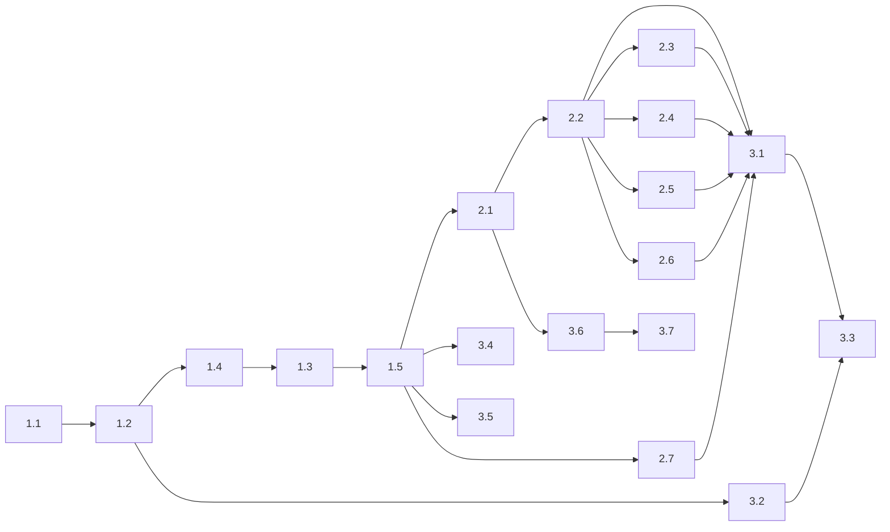

# Sudoku Game — Epics & Dependency Map

## Epic 1: Foundation & Puzzle Engine (5 stories)

Build the core data model, puzzle generation/solving engine, and basic grid rendering.

| Story | Title | Dependencies |
|---|---|---|
| 1.1 | Project Scaffolding | None |
| 1.2 | Data Types and Board Utilities | 1.1 |
| 1.3 | Puzzle Generator | 1.4 |
| 1.4 | Puzzle Solver and Validator | 1.2 |
| 1.5 | Basic Grid Rendering | 1.3 |

## Epic 2: Interactive Gameplay (7 stories)

Add all player interactions: selection, input, notes, errors, undo, and timer.

| Story | Title | Dependencies |
|---|---|---|
| 2.1 | Cell Selection and Highlighting | 1.5 |
| 2.2 | Number Input | 2.1 |
| 2.3 | Erase and Cell Clearing | 2.2 |
| 2.4 | Pencil/Notes Mode | 2.2 |
| 2.5 | Error Highlighting | 2.2 |
| 2.6 | Undo Functionality | 2.2 |
| 2.7 | Game Timer | 1.5 |

## Epic 3: Game Management & Polish (7 stories)

Complete the game loop with new-game flow, persistence, completion, responsive design, and accessibility.

| Story | Title | Dependencies |
|---|---|---|
| 3.1 | Difficulty Selection and New Game Flow | 2.2, 2.3, 2.4, 2.5, 2.6, 2.7 |
| 3.2 | Auto-Save and Game Restoration | 1.2 |
| 3.3 | Puzzle Completion Detection and Celebration | 3.1, 3.2 |
| 3.4 | Responsive Layout — Mobile | 1.5 |
| 3.5 | Responsive Layout — Desktop | 1.5 |
| 3.6 | Keyboard Navigation | 2.1 |
| 3.7 | Accessibility and Screen Reader Support | 3.6 |

## Dependency Graph



## Critical Path

The longest dependency chain determines the minimum sequential effort:

```
1.1 → 1.2 → 1.4 → 1.3 → 1.5 → 2.1 → 2.2 → {2.3, 2.4, 2.5, 2.6} → 3.1 → 3.3
```

## Parallelization Opportunities

After story 2.2, stories 2.3/2.4/2.5/2.6 can be done in any order.
Stories 2.7, 3.2, 3.4, 3.5, 3.6 can run in parallel once their prerequisites are met.
